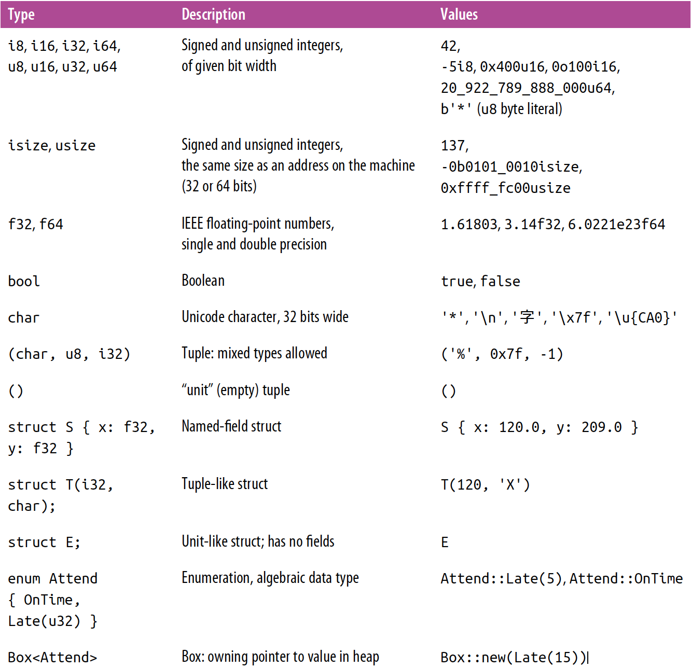
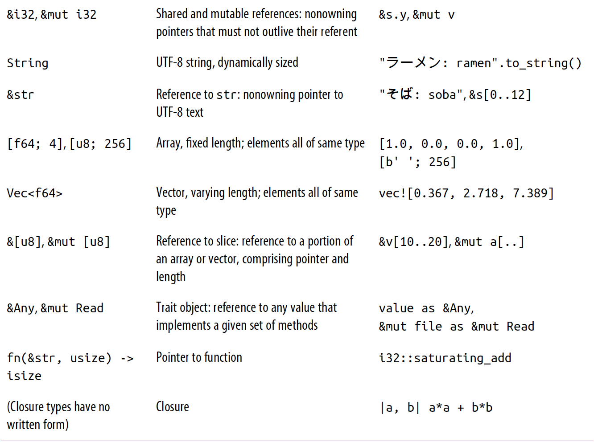

<h1 align="right">基本类型</h1>
<p align="right" style="font-style: Italic;">世界上有许多种好书是因为有很多种人，并且每个人都想读点与众不同的东西。</p>
<br /><p align="right">—Lemony Snicket<p>


Rust的基本类型的设计基于下面几个目标：

*安全*

> 通过程序的类型检查，Rust编译器排除了所有类别的常见错误。通过使用类型安全的替代品去替换空指针和未经检测的元组，Rust甚至能够消除其他语言中因常见的崩溃原因引发的错误。

*效率*

> 程序员可以对Rust程序中如何呈现内存中的值进行细粒度的控制，并且能选择自己知道处理器可以有效处理的类型。程序没有必要为了不使用的通用性和灵活性付出代价。

简洁

> [**TODO:未明确的翻译**]Rust不需要程序员以在代码中写类型的方式提供导向[**Rust manages all of this without requiring too much guidance from the programmer in the form of types written out in the code.**]，它会自己处理好这些事情。与相似的C++的程序相比来说，Rust程序中的类型更整洁。

相较于使用解释器或者即时编译(JIT)的编译器，Rust旨在使用预编译：在开始执行之前，整个程序就已经转为机器代码了。Rust的类型系统帮助预编译器为程序使用的值选择适合的机器级表示：可以预测其性能的表现并完全使用机器的功能。

Rust是一个静态类型的语言：程序不会实时运行，编译会检查所有可能的执行路径，将仅与其类型一致的方式使用值。这允许Rust去提前捕捉程序的错误同时这也对Rust的安全保证至关重要。

相较于JavaScript或Python这种动态类型语言，Rust需要你提前计划：你必须声明函数的参数类型和返回值的类型，结构成员的类型和一些其他构造。然而，Rust的两个特性使得其麻烦程度比你预期的要少：

* 给定一个你声明的类型，Rust会为你推断出剩下中的大多数。实际上，通常只有一种类型适用于给定的变量或表达式；在这种情况下，Rust允许你忽略该类型，例如，你可以向下面这样声明函数中的每种类型：

```rust
fn build_vector() -> Vec<i16> {
    let mut v: Vec<i16> = Vec::<i16>::new();
    v.push(10i16);
    v.push(20i16);
    v
}

```

但这样就显得重复且杂乱无章了。从给定了函数的返回值类型可以明显的看出`v`的类型必然是`Vec<i16>`，一个存储了16位有符号整数的向量；其他类型可能不起作用。从以上我们可以得知，所定义的vector的每一个元素类型必须为`i16`。这正是Rust进行类型推断的推理方式，允许你向下面这样写：

```rust
fn build_vector() -> Vec<i16> {
    let mut v: Vec<i16> = Vec::<i16>::new();
    v.push(10);
    v.push(20);
    v
}

```

这两个函数定义完全等价；对这两个函数而言，Rust会生成相同的机器代码，类型推断使得动态语言的可读性大大提高，同时也能捕捉编译时的错误。

* 可定义泛型函数：当一个函数的目的和实现足够宽泛的时候，你可以定义其在任何类型集上以满足必要的标准。单个定义可以涵盖一组开放式用例。<br/>在Python和JavaScript中，函数的行为的很自然：一个函数可以操控任何其所需的拥有属性和方法的值，（这个特性被称为鸭子类型：如果它活动起来像鸭子，那么他就是鸭子）但这个灵活性也恰恰使得让这些语言很难提前发现类型错误。测试往往是捕捉类似错误的唯一办法。<br />Rust的泛型函数赋予语言同样的自由度，并且仍然在编译时捕捉类型错误。尽管具有灵活性，但是泛型函数和非泛型函数的效率一致。我们会在第11章中讨论泛型函数。

下面是你在Rust中会看见的几种类型的总结。这个表格给出了Rust的原生类型，标准库中很常见的类型和用户自定义类型的例子：
> 译者注：限于时间和精力，图片暂不做翻译，下同




除了以下列出的，这些类型中的大多数本章都会涉及：

* 我们在第九章单独讲`struct`
* 我们将在第十章单独讲enumrated类型
* 我们在第十一章介绍特性（trait）
* 我们在这里会介绍一些`String`和`&str`的要点，但在第十七章中提供更多细节
* 我们在第十四章介绍函数和闭包类型